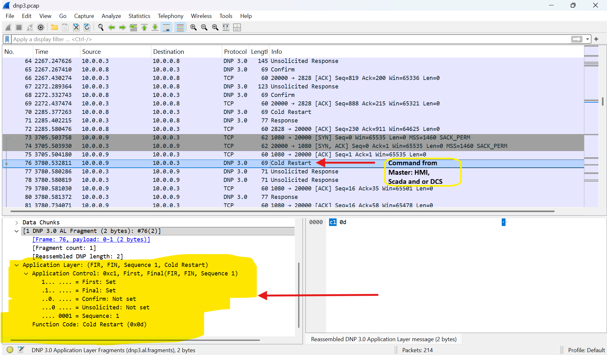
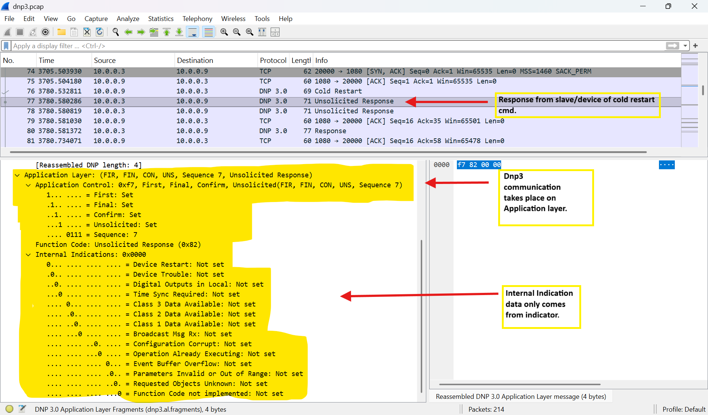
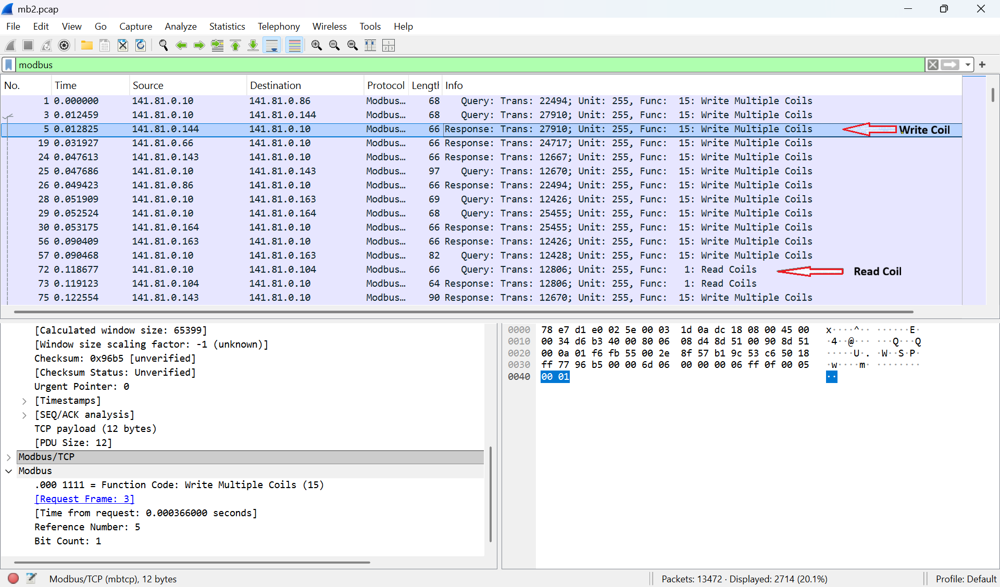

# How SOC Analysts Can Support ICS/OT Cybersecurity
_A practical report informed by OffSec ICS/SCADA Fundamentals, Mike Holcomb’s ICS/OT cyber security series, and protocol analysis_

## Table of Contents
1. Introduction
2. How ICS/OT Differs From Traditional IT
3. Key ICS/OT Concepts for SOC Analysts
4. Common ICS/SCADA Protocols & Security Risks  
   - Modbus  
   - DNP3  
   - OPC & OPC-UA  
   - Other Industrial Protocols  
5. Why Vulnerability Scanning Can Break ICS Devices  
6. How SOC Analysts Can Strengthen ICS/OT Cybersecurity  
7. Passive Network Monitoring  
8. Recommended SOC Use Cases for ICS/OT  
9. Packet Capture Walkthroughs (DNP3 & Modbus)  
10. Conclusion  
11. References  

---

# Introduction
Industrial Control Systems (ICS) and Operational Technology (OT) operate the physical processes behind critical infrastructure—from power generation and water treatment to natural gas distribution, aerospace manufacturing, and industrial automation.

As IT and OT networks converge, SOC analysts play an increasingly critical role in early detection, threat monitoring, and incident response within ICS/OT environments.

This report is informed by:
- OffSec ICS/SCADA Fundamentals  
- ICS/OT Cyber Security Video Series (Parts 1–3) by Mike Holcomb  
- Practical packet inspection of Modbus and DNP3  
- ICS/OT security standards such as ISA/IEC 62443 and NIST SP 800-82  
- Additional ICS cybersecurity resources including CISA 210W-07  

---

# How ICS/OT Differs From Traditional IT

| Aspect | IT Environment | ICS/OT Environment |
|--------|----------------|--------------------|
| Priority | Confidentiality | **Safety & Availability** |
| Impact of Failure | Data loss | **Equipment damage & safety risk** |
| Patching | Frequent | **Rare & risky** |
| Traffic Patterns | Dynamic | **Deterministic** |
| Tools | Active scanning OK | **Active scanning dangerous** |
| Controls | EDR, MFA | **Often unsupported** |

Key takeaway: ICS/OT requires zero-impact monitoring and collaboration with engineering teams.

---

# Key ICS/OT Concepts for SOC Analysts

## 1. OT Network Architecture
Critical components:
- PLCs  
- RTUs  
- HMIs  
- SCADA servers  
- Safety Instrumented Systems (SIS)  
- Data Historians  
- Engineering Workstations  

## 2. Deterministic Traffic
OT networks follow strict cycles:
```
Sensor → PLC → Actuator → HMI/SCADA
```
Deviation = potential cyber or physical problem.

## 3. IT-to-OT Lateral Movement
SOC analysts must monitor:
- OT DMZ  
- Jump hosts  
- Historian communication  
- Remote access into OT networks  

---

# Common ICS/SCADA Protocols & Security Risks

## Modbus
Used in water, power, manufacturing.

### Risks
- No authentication  
- No encryption  
- Accepts writes from any host  

### Dangerous Function Codes
- FC 5 – Write Single Coil  
- FC 6 – Write Single Register  
- FC 15 – Write Multiple Coils  
- FC 16 – Write Multiple Registers  

---

## DNP3
Common in utilities and SCADA systems.

### Risks
- Classic DNP3 = plaintext  
- Susceptible to spoofing & replay  

Includes:
- Unsolicited responses  
- Internal indications  

---

## OPC & OPC-UA
### OPC Classic
- DCOM-based  
- Hard to secure  

### OPC-UA
- Modern, certificate-based  
- Supports encryption & authentication  

---

## Other ICS Protocols
- S7comm  
- EtherNet/IP  
- CIP  
- BACnet  
- IEC-104  

Most lack encryption or authentication.

---

# Why Vulnerability Scanning Can Break ICS Devices
Active scanning (Nmap, Nessus, Rapid7) can:
- Crash PLCs  
- Freeze RTUs  
- Break control loops  
- Cause shutdowns  

**Golden rule:** Never run active scanning in production OT without engineering approval.

---

# How SOC Analysts Can Strengthen ICS/OT Cybersecurity

## Passive Visibility (Best Practice)

Use tools like:
- **Wireshark**  
- **NetworkMiner**  
- **Zeek (ICS modules)**  
- **Suricata (ET ICS rules)**  
- **Security Onion**  
- **Dragos / Nozomi / Claroty**  
- **NetFlow analytics**  

---

# Passive Network Monitoring

## Why Passive Monitoring?
- Zero operational impact  
- ICS protocols often plaintext  
- Enables accurate baselines  

## Safe Capture Points
- SPAN ports  
- TAPs  
- OT firewall (OT side)  
- Historian uplinks  
- Engineering workstation uplinks  

## Never Capture Directly From
- PLC ports  
- Safety system networks  
- Serial-to-IP converters  
- SIS networks  

---

# Recommended SOC Use Cases for ICS/OT

## High-Value Alerts
- PLC firmware changes  
- Ladder logic updates  
- Engineering workstation logins  
- Modbus/DNP3 writes  
- Cross-zone violations  
- Historian anomalies  
- OPC-UA certificate failures  

## Protocol Abnormality Examples
- Modbus FC15 from unknown host  
- DNP3 unsolicited storms  
- S7comm STOP CPU commands  

---

# Packet Capture Walkthroughs (DNP3 & Modbus)

### DNP3 Master Command – Cold Restart


---

### DNP3 Outstation Response – Unsolicited Response


---

### Modbus Coil Read/Write – Function Codes 1 & 15


---

# Conclusion
SOC analysts are essential to ICS cybersecurity.  
Unlike IT security, the focus becomes **process integrity, availability, and safety**.

By using passive visibility, understanding ICS protocols, and working with OT engineers, SOC teams greatly enhance industrial cyber resilience.

---

# References
- OffSec ICS/SCADA Fundamentals  
- ICS/OT Cyber Security Series by Mike Holcomb  
  - Part 1: https://www.youtube.com/watch?v=CCIrntyqe64  
  - Part 2: https://www.youtube.com/watch?v=Ue8JjQigv-4  
  - Part 3: https://www.youtube.com/watch?v=WReeJDw-AV4  
- ISA/IEC 62443  
- NIST SP 800-82  
- CISA 210W-07  
- Modbus, DNP3, OPC-UA specifications  
